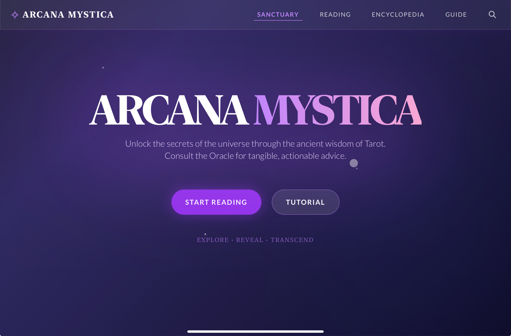
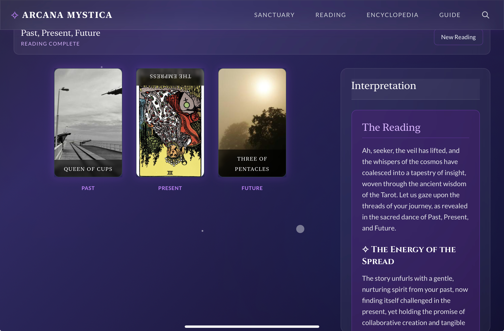

<div align="center">

# ✨ ARCANA MYSTICA

### *Unlock the secrets of the universe through the ancient wisdom of Tarot*

[](https://hongpenggg.github.io/arcana/)
[](https://react.dev/)
[](https://www.typescriptlang.org/)
[](https://vite.dev/)
[](https://openrouter.ai/openrouter/pony-alpha)

**Consult the Oracle for tangible, actionable advice.**

[🔮 Start Reading](#-quick-start) · [📚 Features](#-features) · [🎴 Gallery](#-gallery) · [🛠️ Setup](#%EF%B8%8F-development)

</div>

---

## 🌟 Overview

Arcana Mystica is a modern, AI-powered Tarot reading web application that combines ancient mystical wisdom with cutting-edge technology. Built with React 19 and powered by OpenRouter's Pony Alpha model, it offers an immersive, interactive experience for spiritual guidance and self-reflection.

<div align="center">

### *"Explore • Reveal • Transcend"*

</div>

## ✨ Features

### 🎴 **Interactive Tarot Readings**
- **Multiple Spread Types**: Daily Draw, Past-Present-Future, Mind-Body-Spirit, Career Path, Love & Relationships, and Celtic Cross
- **AI-Powered Interpretations**: Deep, personalized readings generated by Pony Alpha via OpenRouter
- **Card Reversal System**: Authentic upright and reversed meanings
- **Smooth Animations**: Beautiful card shuffling, drawing, and revealing effects

### 📖 **Complete Tarot Encyclopedia**
- **All 78 Cards**: Full Major and Minor Arcana with detailed descriptions
- **Rich Symbolism**: Learn the meaning behind each card's imagery
- **Searchable Database**: Quickly find any card
- **Upright & Reversed**: Comprehensive interpretations for both orientations

### 🎯 **Beginner-Friendly**
- **Interactive Tutorial**: Step-by-step guided first reading
- **Comprehensive Guide**: Learn about Tarot, spreads, and interpretation
- **Accessible Design**: Clean, modern UI with intuitive navigation

### 🔮 **Mystical Experience**
- **Atmospheric Design**: Purple gradients, glass-morphism, and ethereal animations
- **Immersive Sound**: Card shuffling and ambient effects (optional)
- **Responsive**: Perfect on desktop, tablet, and mobile devices

## 🎴 Gallery

<div align="center">

### 🏠 Sanctuary (Home)


*Welcome to the mystical sanctuary. Begin your journey into the Tarot.*

---

### 📚 Choose Your Spread


*Six carefully crafted spreads for different aspects of life.*

---

### 🃏 Interactive Reading


*Draw cards, reveal them one by one, and receive AI-powered interpretations.*

---

### 📖 Tarot Encyclopedia


*Explore all 78 cards with beautiful Rider-Waite imagery and detailed meanings.*

---

### 📚 Beginner's Guide


*Learn the fundamentals of Tarot reading and interpretation.*

</div>

## 🚀 Quick Start

### Online Demo

Visit the live app: **[https://hongpenggg.github.io/arcana/](https://hongpenggg.github.io/arcana/)**

### Local Development

```bash
# Clone the repository
git clone https://github.com/hongpenggg/arcana.git
cd arcana

# Install dependencies
npm install

# Set up environment variables
cp .env.example .env.local
# Add your OpenRouter API key to .env.local

# Start development server
npm run dev
```

Open [http://localhost:5173](http://localhost:5173) in your browser.

## 🛠️ Development

### Prerequisites

- Node.js 20+ and npm
- An OpenRouter API key ([Get one free](https://openrouter.ai/keys))

### Environment Variables

Create a `.env.local` file:

```env
VITE_OPENROUTER_API_KEY=your_openrouter_api_key_here
VITE_SITE_URL=https://yoursite.com
VITE_APP_NAME=Arcana Mystica
```

### Available Scripts

```bash
npm run dev      # Start development server
npm run build    # Build for production
npm run preview  # Preview production build
npm run type-check # TypeScript type checking
```

### Tech Stack

- **Frontend**: React 19 + TypeScript
- **Build Tool**: Vite 6.2
- **AI**: OpenRouter Pony Alpha (free model with 200K context)
- **Styling**: Tailwind CSS + Custom Animations
- **Markdown**: react-markdown for formatted readings
- **Deployment**: GitHub Pages

## 🎨 Key Features Explained

### AI-Powered Readings

Arcana Mystica uses OpenRouter's Pony Alpha model to generate:
- **Personalized interpretations** based on your specific spread and cards
- **Contextual analysis** of how cards interact with each other
- **Actionable advice** with concrete steps you can take
- **Beautiful markdown formatting** for easy reading
- **Free unlimited requests** - Pony Alpha is completely free on OpenRouter

### Spread Types

1. **Daily Draw** - Single card guidance for your day
2. **Past, Present, Future** - Timeline understanding of your situation
3. **Mind, Body, Spirit** - Holistic self-assessment
4. **Career Path** - Professional trajectory clarity
5. **Love & Relationships** - Heart dynamics exploration
6. **Celtic Cross** - Comprehensive 10-card deep dive

### Card Database

All 78 Rider-Waite cards with:
- High-quality imagery
- Detailed symbolism descriptions
- Upright meanings
- Reversed interpretations
- Keywords for quick reference

## 🔧 Configuration

### OpenRouter API Setup

1. Visit [OpenRouter Keys](https://openrouter.ai/keys)
2. Create a new API key (free tier available)
3. Add to `.env.local` as `VITE_OPENROUTER_API_KEY`
4. The app includes retry logic and error handling

### GitHub Secrets (for deployment)

For GitHub Pages deployment:
1. Go to your repository Settings → Secrets and variables → Actions
2. Add a new secret named `VITE_OPENROUTER_API_KEY`
3. Paste your OpenRouter API key
4. The GitHub Actions workflow will use this during build

### Customization

Key files to modify:
- `src/constants.ts` - Card data and spread definitions
- `src/types.ts` - TypeScript interfaces
- `services/openRouterService.ts` - AI prompt customization
- `index.css` - Global styles and animations

## 📱 Responsive Design

Arcana Mystica is fully responsive:
- **Desktop**: Full immersive experience with side-by-side layouts
- **Tablet**: Optimized touch interactions
- **Mobile**: Portrait-friendly card layouts and navigation

## 🤝 Contributing

Contributions are welcome! Feel free to:
- Report bugs
- Suggest new features
- Submit pull requests
- Improve documentation

## 📄 License

This project is open source and available under the MIT License.

## 🙏 Acknowledgments

- **Rider-Waite Tarot Deck** - Classic imagery (public domain)
- **OpenRouter & Pony Alpha** - Free AI-powered interpretations
- **React Team** - Amazing framework
- **Tarot Community** - Endless inspiration

## 🔮 About Tarot

Tarot is a tool for storytelling, reflection, and intuition. It consists of 78 cards divided into:

- **Major Arcana (22 cards)**: Life's karmic and spiritual lessons
- **Minor Arcana (56 cards)**: Daily trials and tribulations
  - Cups (emotions)
  - Swords (intellect)
  - Wands (passion)
  - Pentacles (material world)

Tarot is not about predicting the future, but rather reflecting on the present to make better choices for your path ahead.

---

<div align="center">

**Made with ✨ and 🔮 by [Hongpeng Wei](https://github.com/hongpenggg)**

*"The cards never lie, but they speak in whispers."*

[⬆ Back to Top](#-arcana-mystica)

</div>
